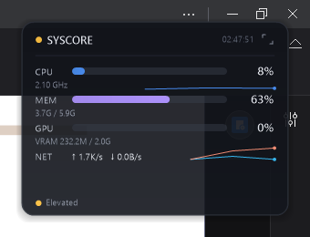
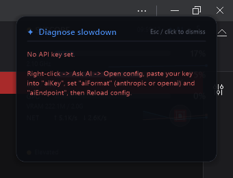
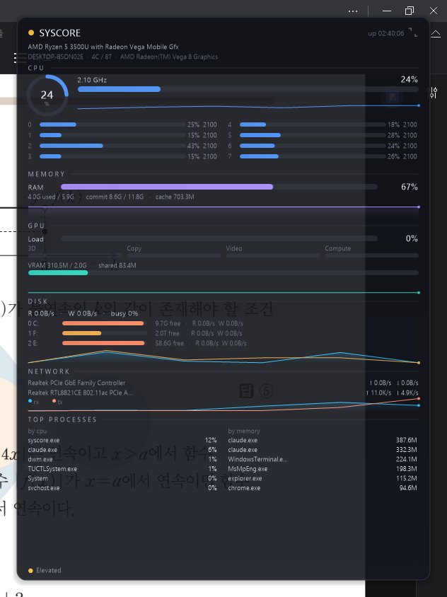

<div align="center">

# SYSCORE

**A tiny, modern, AI-powered system monitor for Windows.**
Always-on-top · semi-transparent · ~1 MB · ~18 MB RAM · zero dependencies.

[](https://github.com/j0shua-SYSON/SYSCORE/actions/workflows/build.yml)


 &nbsp; 

</div>

SYSCORE is a native C++ (Win32 + GDI+ + PDH) floating HUD. It draws a per-pixel-alpha
translucent panel that sits on top of everything, shows a *lot* of accurate live data, and
can **ask an LLM what's wrong with your PC** — all without Electron, a runtime, or a single
third-party library. The whole thing is one ~1 MB statically-linked `.exe`.

## ✨ Features

- **Compact ⇄ expanded.** A small always-on-top bar that double-clicks into a full dashboard.
- **Everything, live:** CPU (overall + per-core usage & clock), memory (+ commit & cache),
  GPU load + engine breakdown + VRAM, per-disk throughput & free space, per-NIC network,
  and top processes by CPU and memory — all updating once a second with smooth sparklines.
- **🤖 Ask your PC (AI).** Click **✦ AI** (or press `Ctrl+Alt+A`) and SYSCORE sends a small
  live snapshot to an LLM and shows a plain-English diagnosis + fixes — *"chrome.exe is using
  2.1 GB across 4 tabs; close them or restart it."* Works with the **Anthropic** or any
  **OpenAI-compatible** endpoint. Bring your own key.
- **Modern, minimal UI.** High-contrast readouts on a soft-shadow slate panel, per-metric
  accent colors, a ring gauge, smooth bars. Right-click for opacity, refresh rate, and more.
- **Featherweight.** ~18 MB RAM, configurable 10–60 fps render, 1 Hz sampling. It's a system
  monitor — it behaves like a good citizen.

<div align="center">



*the expanded dashboard*

</div>

## 🤖 Ask your PC — setup

The AI feature talks to a cloud endpoint over the system's `winhttp.dll` (no install, no
SDK). It only sends a **small text snapshot** of your metrics, and **only when you ask**.

1. Run SYSCORE once, then **right-click → ✦ Ask AI → Open config file…**
2. In `config.json` set:
   ```json
   "aiFormat":  "anthropic",
   "aiEndpoint":"https://api.anthropic.com/v1/messages",
   "aiModel":   "claude-haiku-4-5-20251001",
   "aiKey":     "sk-ant-..."
   ```
   For an OpenAI-compatible API instead:
   ```json
   "aiFormat":  "openai",
   "aiEndpoint":"https://api.openai.com/v1/chat/completions",
   "aiModel":   "gpt-4o-mini",
   "aiKey":     "sk-..."
   ```
   It also works with any local OpenAI-compatible server (LM Studio, llama.cpp, Ollama's
   `/v1`) — just point `aiEndpoint` at it.
3. **Right-click → ✦ Ask AI → Reload config**, then hit **✦ AI** / `Ctrl+Alt+A` (diagnose)
   or `Ctrl+Alt+H` (health report).

> Your key lives only in `%APPDATA%\SYSCORE\config.json` on your machine. Nothing is sent
> anywhere until you trigger a request.

## 📊 How the data is collected

| Metric | Source |
|---|---|
| CPU per-core usage | `NtQuerySystemInformation(SystemProcessorPerformanceInformation)` |
| CPU clock | `CallNtPowerInformation(ProcessorInformation)` |
| Memory | `GlobalMemoryStatusEx` + `GetPerformanceInfo` |
| GPU load | PDH `\GPU Engine(*)\Utilization Percentage` (aggregated by engine) |
| VRAM | PDH `\GPU Adapter Memory(*)\Dedicated/Shared Usage` + DXGI |
| Disk | PDH `\PhysicalDisk(*)\…` + `GetDiskFreeSpaceEx` |
| Network | PDH `\Network Interface(*)\Bytes Received/Sent/sec` |
| Processes | `NtQuerySystemInformation(SystemProcessInformation)` |

All PDH counters use the **English** API, so they work on non-English Windows.
Temperatures show `--` when no sensor is exposed (common on laptops / AMD iGPUs without admin).

## 🛠 Build

Needs **MinGW-w64 g++** (tested 15.2.0). No other tooling.

```powershell
powershell -ExecutionPolicy Bypass -File .\build.ps1     # -> build\syscore.exe
```
…or with CMake: `cmake -S . -B build -G "MinGW Makefiles" && cmake --build build`.

Prebuilt binaries are produced by CI on every tagged release (see the **Actions** tab).

## ▶ Run

```powershell
.\run.ps1     # builds if needed, then launches
```
…or just double-click `build\syscore.exe`. It's portable — copy it anywhere.

## ⌨ Controls

| Action | Result |
|---|---|
| **Drag** | move the panel (stays on-screen) |
| **Double-click** / `E` / the ⤢ icon | compact ⇄ expanded |
| **✦ AI** button / `Ctrl+Alt+A` | AI: diagnose slowdown |
| `Ctrl+Alt+H` | AI: health report |
| **Mouse wheel** | adjust opacity |
| **Right-click** | menu: Ask AI, expand, always-on-top, top-processes, opacity, refresh rate, quit |
| `Esc` | dismiss the AI panel, or quit |

## ⚙ Configuration

`%APPDATA%\SYSCORE\config.json` (created on first run, persisted on change):

| Key | Meaning |
|---|---|
| `themeName` | UI theme (more themes coming) |
| `opacity` | 60–255 global panel opacity |
| `targetFps` | render cadence: 10 / 20 / 30 / 60 |
| `alwaysOnTop`, `showProcs`, `expanded` | UI toggles |
| `aiEnabled` | turn the AI feature on/off |
| `aiFormat` | `anthropic` or `openai` |
| `aiEndpoint`, `aiModel`, `aiKey` | LLM endpoint, model id, API key |

## 🗺 Roadmap

- [x] Modern minimal UI, compact ⇄ expanded, live graphs
- [x] AI "Ask your PC" (configurable Anthropic / OpenAI endpoint)
- [x] JSON config + persistence
- [ ] **Themes** — Nord / Dracula / Tokyo Night / Light / Matrix + custom accent
- [ ] **Power tools** — per-process GPU, threshold alerts + toasts, tray mini-stats, start-with-Windows
- [ ] **AI anomaly watch** (background) + natural-language control ("kill all Adobe")
- [ ] **Game/overlay mode** + thermal/throttle warnings

## 🤝 Contributing

PRs welcome — see [CONTRIBUTING.md](CONTRIBUTING.md). The one hard rule: **no new
dependencies** (system APIs only). Platform notes live in [CLAUDE.md](CLAUDE.md).

## 📄 License

[MIT](LICENSE) © 2026 Joshua Son ([@j0shua-SYSON](https://github.com/j0shua-SYSON))
